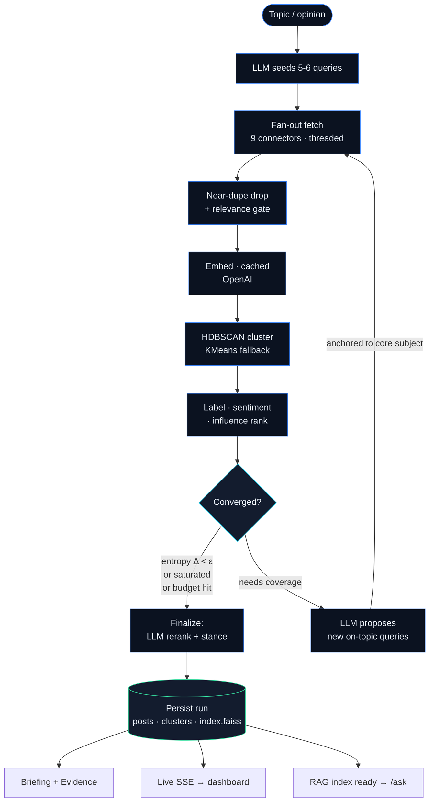
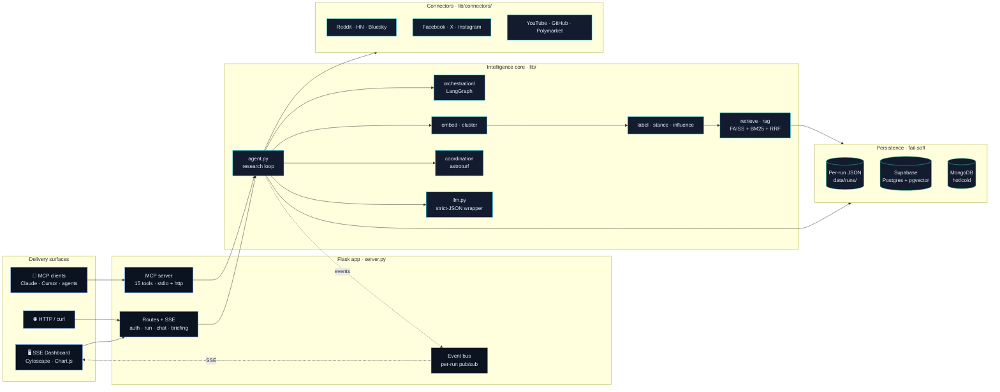
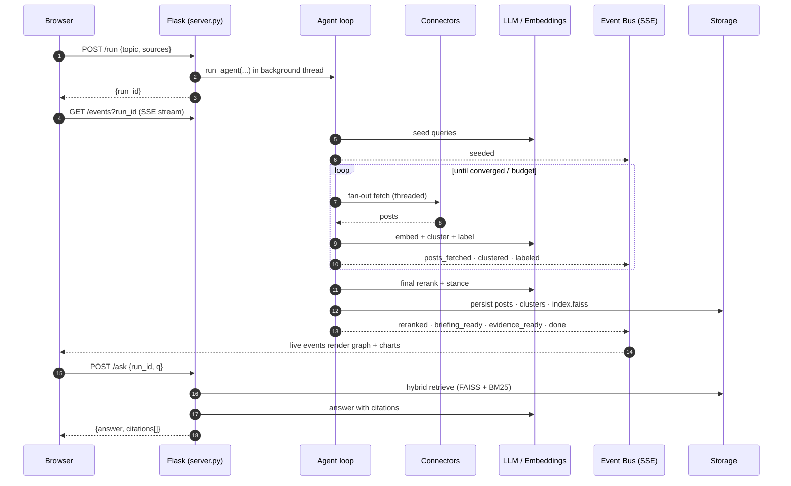
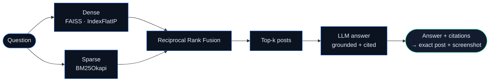
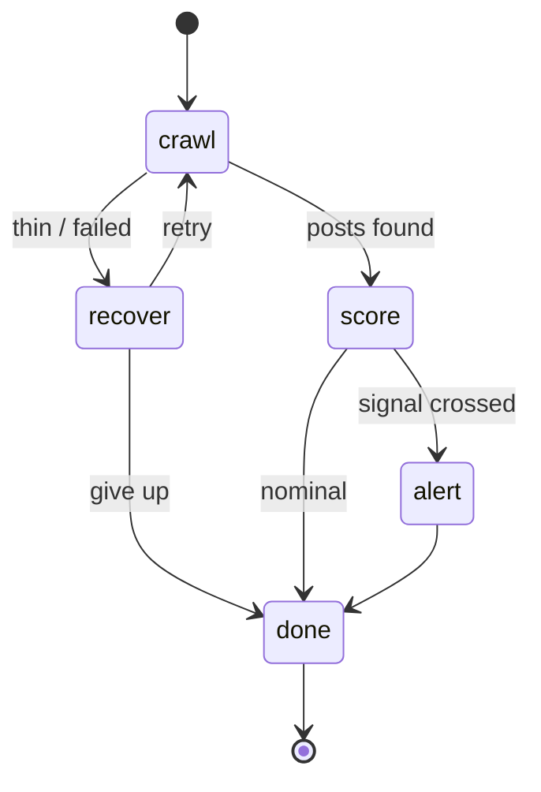
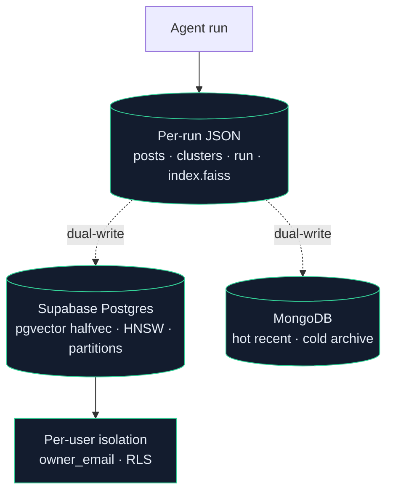
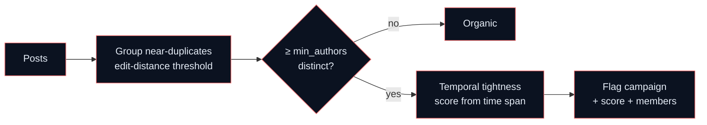

<div align="center">

# 🌐 PulseTrace

### Agentic, multi-source social sentiment intelligence — from a raw topic to a cited, defensible brief.

*Give it a topic. An LLM-driven agent writes its own search queries, pulls posts from nine social sources, embeds and clusters them into themes, scores sentiment, ranks the loudest voices, flags manufactured consensus, and answers your follow-up questions with citations back to real posts — streaming every step live.*

<br/>

[](https://www.python.org/)
[](https://flask.palletsprojects.com/)
[](https://langchain-ai.github.io/langgraph/)
[](https://modelcontextprotocol.io/)
[](https://github.com/facebookresearch/faiss)
[](#-testing)
[](https://pulsetrace.publicvm.com)
[](#-license)

<br/>


<br/>

### ▶️ 60-second demo — topic in, cited brief out


*Live: agent writes its own queries → multi-source crawl → clusters + sentiment → cited answers, every step streamed.*

</div>

---

> **For reviewers in a hurry:** PulseTrace is a deployed, multi-user web **platform** (not a CLI script) that runs an autonomous research loop over 9 social connectors, persists every run to tiered storage (Postgres + pgvector + MongoDB), exposes the whole pipeline over the **Model Context Protocol** as 15 real tools, and ships a live SSE dashboard. ~10.2K lines of typed Python, **386 tests**, LangGraph orchestration, OAuth, hybrid RAG with citations, and a coordinated-inauthenticity detector. On a blind LLM-judged relevance benchmark it beats the strongest open-source contender by **+38% nDCG@5**.

<br/>

## 📸 Proof — driving the entire platform through MCP, end-to-end

PulseTrace runs as an MCP server, so any agent (Claude Code shown here) can crawl, cluster, score sentiment, and ask grounded questions with **zero mock data** — every number traces back to a real scraped run on disk.

<div align="center">

| Live crawl via MCP | Sentiment + themes + consensus | Cited RAG answers |
|:---:|:---:|:---:|
|  |  |  |

*An agent starts a crawl session, polls it live, then reads back a 155-post / 5-cluster sentiment breakdown and answers questions with inline citations (`[1trn4o8]`, `[1u8h6f]`) that point at the exact posts.*

</div>

---

## 📑 Table of contents

- [Why PulseTrace exists](#-why-pulsetrace-exists)
- [Feature tour](#-feature-tour)
- [The agentic research loop](#-the-agentic-research-loop)
- [System architecture](#%EF%B8%8F-system-architecture)
- [Request lifecycle](#-request-lifecycle-topic--live-brief)
- [Hybrid RAG with citations](#-hybrid-rag-with-citations)
- [Durable orchestration (LangGraph)](#-durable-orchestration-langgraph)
- [Tiered storage](#-tiered-storage)
- [MCP — the platform as 15 tools](#-mcp--the-platform-as-15-tools)
- [Coordinated-inauthenticity detection](#-coordinated-inauthenticity-detection)
- [Benchmark — proof of quality](#-benchmark--proof-of-quality)
- [Tech stack](#-tech-stack)
- [Quick start](#-quick-start)
- [HTTP API](#-http-api)
- [Project layout](#-project-layout)
- [Deployment](#-deployment)
- [Testing](#-testing)
- [Engineering principles](#-engineering-principles)
- [Source reliability (honest accounting)](#-source-reliability-honest-accounting)
- [Roadmap](#-roadmap)

---

## 💡 Why PulseTrace exists

Social platforms hold the most honest, real-time signal about any topic — and it's almost unusable. It's scattered across sites, drowning in noise, full of bots, and stale by the time a human reads it.

Most tools stop at *search*: they hand you a list of links. PulseTrace closes the loop into *intelligence*:

- It **decides what to search next** instead of waiting for you to phrase the perfect query.
- It **organizes the crowd into themes** and tells you the consensus, not just the loudest post.
- It **separates real opinion from manufactured opinion** — the coordination detector is the moat.
- It **remembers**: every run is a persistent, queryable asset you can interrogate weeks later.
- It is **agent-native**: the same pipeline is a human dashboard *and* a 15-tool MCP server.

---

## 🧭 Feature tour

| Capability | What it does | Where it lives |
|---|---|---|
| 🤖 **Agentic research loop** | LLM seeds queries, inspects clusters, expands into coverage gaps, and stops on entropy convergence / saturation / budget — no human in the loop. | `lib/agent.py` |
| 🔌 **9 social connectors** | Reddit, Hacker News, Facebook, X/Twitter, Instagram, YouTube, Polymarket, GitHub, Bluesky — pluggable, fail-soft (a dead source never kills a run). | `lib/connectors/` |
| 🧬 **Embedding topic discovery** | OpenAI embeddings + HDBSCAN clustering with KMeans fallback; SHA1-keyed on-disk cache makes re-runs nearly free. | `lib/embed.py`, `lib/cluster.py` |
| 🏷️ **Auto-labeling & sentiment** | Each cluster is named and scored pos/neu/neg by batched LLM calls. | `lib/label.py`, `lib/stance.py` |
| 📣 **Influence ranking** | Engagement + recency-decay surfaces the posts that actually moved each theme. | `lib/influence.py`, `lib/rerank.py` |
| 🔍 **Hybrid RAG + citations** | FAISS (dense) **+** BM25 (sparse) fused with Reciprocal Rank Fusion; answers cite the exact post ids. | `lib/retrieve.py`, `lib/rag.py` |
| 🕵️ **Astroturf detection** | Near-duplicate text from many authors in a tight window → flagged coordinated campaign with a score. | `lib/coordination.py` |
| 💬 **Conversational workspace** | Multi-turn chat over a run with rolling-summary memory (compacts old turns into a running summary). | `lib/chat_engine.py`, `lib/chat_memory.py` |
| 📊 **Live SSE dashboard** | Topic graph (Cytoscape), sentiment charts (Chart.js), streaming progress, ask-box — no build step, results render live as the agent works. | `templates/`, `static/js/` |
| 📄 **Briefing & evidence export** | One-click HTML/PDF brief; opinion mode builds a pro/con evidence ledger with cited support. | `lib/briefing.py`, `lib/evidence.py` |
| 🧩 **MCP server (15 tools)** | The full pipeline exposed over Model Context Protocol — stdio for Claude CLI, streamable-HTTP for remote agents. | `mcp_server.py`, `lib/mcp/` |
| 🔁 **Durable orchestration** | LangGraph state machine wraps the loop with crawl → score → alert/recover routing. | `lib/orchestration/` |
| 🗄️ **Tiered storage** | Per-run JSON on disk, with additive dual-write to Supabase Postgres (pgvector) + MongoDB; degrades gracefully when DBs are absent. | `db/`, `lib/store.py` |
| 🔐 **Auth & isolation** | Supabase GoTrue email + Google/GitHub OAuth, per-user `owner_email` isolation of runs and chat history. | `db/auth_users.py`, `lib/auth.py` |
| 🔑 **BYOK** | Bring-your-own-key validation endpoint so users supply their own LLM credentials. | `lib/keys.py`, `static/js/byok.js` |

---

## 🖼️ Product gallery

<table>
<tr>
<td width="50%"><br/><sub><b>Per-user workspace</b> — email + Google/GitHub OAuth, Supabase-backed.</sub></td>
<td width="50%"><br/><sub><b>Run panel</b> — pick sources, optional opinion, watch the LangGraph state machine (crawl→score→alert→recover→done).</sub></td>
</tr>
<tr>
<td width="50%"><br/><sub><b>Live topic graph</b> — clusters as nodes, sentiment-colored, with per-cluster feel bars and talking points.</sub></td>
<td width="50%"><br/><sub><b>Synthesized brief</b> — pipeline trace, sentiment by topic, main talking points, and what people are actually saying (cited).</sub></td>
</tr>
<tr>
<td width="50%"><br/><sub><b>Opinion-mode evidence ledger</b> — for/against split with per-claim confidence, every point backed by the posts behind it.</sub></td>
<td width="50%"><br/><sub><b>One-click PDF briefing</b> — executive summary, metrics, topic graph, and sentiment-by-cluster, export-ready.</sub></td>
</tr>
</table>

---

## 🤖 The agentic research loop

The core differentiator. This is not a search wrapper — it's a closed control loop with explicit, tunable stop conditions (`MAX_ITERS=4`, `MAX_POSTS=500`, entropy ε, saturation, LLM stop signal).



**Why this matters to an engineer:** every expensive operation is deliberately placed. Stance scoring and the LLM rerank are *deferred out of the loop* into a single finalize pass so per-iteration cost stays low while the live UI stays responsive. Expansion queries are re-anchored to the topic's core subject so the agent doesn't drift off-topic. Low-recall iterations fall back to the raw topic instead of failing.

---

## 🏗️ System architecture

Clean separation by responsibility (soft 200-line cap per module). One pure-logic core, three delivery surfaces (web UI, HTTP API, MCP), and a fail-soft persistence tier.



---

## 🔄 Request lifecycle: topic → live brief



---

## 🔍 Hybrid RAG with citations

Dense semantic search alone misses exact-keyword matches; sparse search alone misses paraphrase. PulseTrace runs both and fuses the rankings with **Reciprocal Rank Fusion**, then asks the LLM to answer *only* from retrieved context and cite post ids.



Citations resolve to the originating post — and for Facebook runs, to the captured screenshot of that post — so every claim is auditable. (`lib/retrieve.py`, `lib/rag.py`)

---

## 🔁 Durable orchestration (LangGraph)

The raw loop is wrapped in a LangGraph state machine that adds scoring, alerting, and a recovery branch (re-crawl when a run comes back thin), exposed at `POST /api/agent/run` with the same SSE stream.



`lib/orchestration/{state,nodes,graph,runner}.py`

---

## 🗄️ Tiered storage

Storage is **additive and fail-soft**: the filesystem is always the source of truth, and the databases are best-effort dual-writes. Pull the DB credentials and everything still runs on JSON.



`db/supabase_client.py`, `db/mongo_client.py`, `db/auth_users.py`, `lib/store.py`

---

## 🧩 MCP — the platform as 15 tools

Every part of the pipeline is callable over the Model Context Protocol, so PulseTrace is usable by *any* agent host, not just its own UI. Stdio transport for Claude CLI; streamable-HTTP on `:8000` (auto-started with the Flask app) for remote agents.

<div align="center">


<sub>`/mcp` in Claude Code — the `pulsetrace` server advertising its 15 live tools.</sub>

</div>

| # | Tool | Category | Does |
|---|---|---|---|
| 1 | `start_crawl_session` | Data | Kick off a new crawl on a topic |
| 2 | `get_crawl_status` | Data | Poll a running session |
| 3 | `cancel_crawl_session` | Data | Stop a session |
| 4 | `list_crawl_sessions` | Data | Paginated session history |
| 5 | `get_posts_by_session` | Data | Posts for a session (optional keyword) |
| 6 | `get_post_detail` | Data | Single post by id |
| 7 | `get_top_posts` | Data | Highest-influence posts |
| 8 | `get_keyword_summary` | Data | Per-cluster keyword rollup |
| 9 | `run_inference` | Intelligence | Build the executive inference doc |
| 10 | `get_inference_result` | Intelligence | Read back the inference |
| 11 | `query_rag` | Intelligence | Cited RAG answer over a session |
| 12 | `get_sentiment_breakdown` | Intelligence | Overall + per-keyword sentiment + confidence |
| 13 | `get_schema_validation_report` | Intelligence | Data-quality / schema audit |
| 14 | `trigger_enrichment_batch` | Intelligence | Backfill engagement + sentiment fields |
| 15 | `detect_coordination` | Intelligence | Astroturf / coordinated-campaign radar |

> See [`DEMO.md`](DEMO.md) for the 3-minute MCP demo script and pre-wired slash commands (`/pulse`, `/pulse-coord`, `/pulse-ask`).

---

## 🕵️ Coordinated-inauthenticity detection

The signal everyone else misses: *is this opinion real, or manufactured?* PulseTrace groups near-duplicate text across distinct authors and measures temporal tightness — many authors posting near-identical content in a short window scores as a coordinated campaign.



`lib/coordination.py` — exposed as the `detect_coordination` MCP tool.

---

## 📊 Benchmark — proof of quality

PulseTrace was measured head-to-head against the **strongest open-source contender on the market** (the `last30days-skill`, a CLI research skill) on a blind relevance benchmark: same LLM model, same sources (Reddit + HN), and an independent LLM judge grading results per query (`eval/compare_agents.py`, baseline frozen in `eval/l30d_baseline.json`).

| Metric | Strongest contender | **PulseTrace** | Delta |
|---|:---:|:---:|:---:|
| **nDCG@5** (ranking quality) | 0.520 | **0.716** | **+38%** |
| **Precision@5** | 0.467 | **0.533** | **+14%** |
| **Mean relevance grade** | 1.375 | **1.583** | **+15%** |

On hard, ambiguous queries the contender returned **zero** usable results where PulseTrace still surfaced a ranked, cited brief. PulseTrace does an order of magnitude more work per run (multi-source fan-out, clustering, coordination analysis, a persistent queryable index) — and *still* wins on ranking quality, all through proprietary agentic query expansion and rerank.

> 📌 *To regenerate: `python eval/compare_agents.py` (requires source credentials + an LLM backend).*

---

## 🧰 Tech stack

| Layer | Technology |
|---|---|
| **Language** | Python 3.12, fully type-hinted, `from __future__ import annotations` |
| **Web** | Flask 3 + Server-Sent Events (no polling) |
| **Frontend** | Jinja partials + vanilla ES modules (14 of them), Chart.js, Cytoscape.js — **zero build step**, CDN only |
| **LLM / embeddings** | OpenAI SDK (pluggable to Ollama via `PULSETRACE_BACKEND`) through a strict-JSON wrapper |
| **Clustering** | scikit-learn, HDBSCAN (KMeans fallback), NumPy |
| **Retrieval** | FAISS (dense) + `rank_bm25` (sparse) + RRF |
| **Orchestration** | LangGraph state machine + n8n workflow exports |
| **Agent protocol** | Model Context Protocol (`mcp>=1.12`) — stdio + streamable-HTTP |
| **Scraping** | Playwright, PRAW, twikit, instaloader, yt-dlp, requests |
| **Storage** | Supabase Postgres + pgvector, MongoDB, per-run JSON |
| **Auth** | Supabase GoTrue + Google/GitHub OAuth, per-user isolation |
| **Docs/export** | WeasyPrint (PDF briefings), Pillow |
| **Quality** | pytest (386 tests), pytest-cov, ruff, mypy |
| **Deploy** | Docker + gunicorn + nginx + HTTPS (certbot) |

---

## 🚀 Quick start

**Prereqs:** Python 3.10+ (3.12 recommended), an OpenAI API key, free Reddit script-app credentials.

```bash
git clone https://github.com/abrr-fhyz/PulseTrace.git
cd PulseTrace
git checkout shyan

python3 -m venv .venv
.venv/bin/pip install -r requirements.txt

cp .env.example .env        # fill OPENAI_API_KEY, REDDIT_CLIENT_ID, REDDIT_CLIENT_SECRET
.venv/bin/python server.py  # → http://localhost:5000
```

Enter a topic (e.g. `Bangladesh election`, `Rust async`, `Fable 5`), toggle sources (Reddit + HN work out of the box), hit **Start agent**, and watch the brief build live.

**Backend selector:** `PULSETRACE_BACKEND=openai|ollama` (default `openai`). The Ollama path runs the whole pipeline locally — see `.claude/memory/testing-with-ollama.md`.

---

## 🌐 HTTP API

| Method | Path | Body / Query | Returns |
|---|---|---|---|
| `POST` | `/run` | `{"topic","sources":["reddit","hn"]}` | `{"run_id"}` |
| `POST` | `/api/agent/run` | `{"topic","sources"}` | LangGraph-orchestrated run |
| `GET` | `/events?run_id=` | — | `text/event-stream` of agent events |
| `GET` | `/graph?run_id=` | — | `{nodes, edges}` for Cytoscape |
| `POST` | `/ask` | `{"run_id","q"}` | `{answer, citations, retrieved}` |
| `POST` | `/chat/ask` | `{"thread_id","q"}` | conversational answer (rolling memory) |
| `GET` | `/run/<id>/briefing/pdf` | — | rendered PDF brief |
| `GET` | `/run/<id>/evidence` | — | pro/con evidence ledger |
| `GET` | `/run/<id>/voices` | — | top influencers |
| `POST` | `/byok/validate` | `{"provider","key"}` | key validation |
| `GET` | `/runs` · `DELETE /runs/<id>` | — | run history (per user) |

SSE event types: `started · seeded · iter_start · posts_fetched · deduped · relevance_gated · clustered · saturation · labeled · reranked · briefing_ready · evidence_ready · done`.

---

## 📂 Project layout

```
PulseTrace/
├── server.py                 # Flask app: routes + SSE + auth + chat (43 routes)
├── mcp_server.py             # MCP entrypoint (stdio) — registers 15 tools
├── main.py                   # legacy v1 FB-scraper CLI
├── lib/
│   ├── agent.py              # ⭐ the agentic research loop
│   ├── connectors/           # 9 pluggable sources (base ABC + impls)
│   ├── embed.py cluster.py   # cached embeddings + HDBSCAN/KMeans
│   ├── label.py stance.py    # cluster naming + sentiment
│   ├── influence.py rerank.py relevance.py   # ranking
│   ├── retrieve.py rag.py    # hybrid FAISS+BM25 RAG with citations
│   ├── coordination.py       # astroturf detection
│   ├── chat_engine.py chat_memory.py chat_store.py   # conversational RAG
│   ├── briefing.py evidence.py   # HTML/PDF brief + evidence ledger
│   ├── llm.py                # strict-JSON LLM wrapper (one retry)
│   ├── events.py store.py    # SSE bus + per-run persistence
│   ├── orchestration/        # LangGraph state machine
│   └── mcp/                  # MCP tool implementations
├── db/                       # Supabase (pgvector) + Mongo + auth
├── templates/                # Jinja dashboard + partials
├── static/{js,css}/          # 14 ES modules, themed CSS tokens
├── eval/                     # head-to-head benchmark harness
├── tests/                    # 386 tests, mirrors lib/ structure
└── data/runs/<run_id>/       # posts · clusters · run · index.faiss
```

---

## 🛳️ Deployment

Live at **[pulsetrace.publicvm.com](https://pulsetrace.publicvm.com)** — Docker + gunicorn behind nginx with HTTPS (certbot).

```bash
docker compose up        # Flask via gunicorn + MCP auto-spawned on :8000
```

The MCP server auto-starts with the app (`lib/mcp_autostart.py`, gunicorn `when_ready`); toggle with `PT_MCP_AUTOSTART=0`. Full deploy notes in [`DEPLOY.md`](DEPLOY.md).

---

## 🧪 Testing

**386 tests** across 54 files, mirroring module structure. External IO (HTTP, OpenAI, scrapers) is mocked; live paths are gated behind env vars.

```bash
.venv/bin/python -m pytest -v                  # default: fully mocked, no network

# full live suite (real Ollama + real Facebook scrape)
PULSETRACE_BACKEND=ollama FB_INTEGRATION=1 \
  .venv/bin/python -m pytest -v -m "slow or not slow"
```

TDD covers all pure logic: clustering, entropy/saturation convergence, RRF, influence scoring, dedup, relevance gating, schema validation, chat memory compaction, and per-user isolation.

---

## 🎯 Engineering principles

These are enforced conventions, not aspirations (`.claude/rules/`):

- **One responsibility per module**, soft 200-line cap — split by responsibility, not layer.
- **Fail-soft everywhere:** a dead connector returns `[]` and logs; HDBSCAN failure falls back to KMeans; missing DBs fall back to JSON. *Nothing kills the run.*
- **All structured LLM output** goes through one wrapper (`lib/llm.py:chat_json`) with `json_object` mode + one retry.
- **Cost discipline:** embedding cache, `MAX_POSTS=500` hard cap, expensive LLM rerank deferred to a single finalize pass.
- **Type hints required**, built-in generics, narrow exception handling — never bare `except`.
- **No secrets in code**, `.env` gitignored, read via `os.environ.get`.
- **Conventional Commits**, one concern per commit.

---

## 🛰️ Source reliability (honest accounting)

| Source | Status | Auth |
|---|---|---|
| **Reddit** · **Hacker News** · **Polymarket** | ✅ reliable, on by default | Reddit creds / none |
| **GitHub** · **Bluesky** | ✅ reliable | token / app password |
| **YouTube** | ⚠️ best-effort | yt-dlp |
| **Facebook** | ⚠️ fragile (main scrape target) | `info/cookies.json` |
| **X / Twitter** · **Instagram** | ⚠️ fragile, credential-gated | session files |

Closed platforms (FB/X/IG) drift and rate-limit; use throwaway accounts, expect periodic selector breakage. Every connector catches its own exceptions and returns `[]`, so a broken source degrades recall but never crashes a run. Full caveats: `.claude/memory/source-risks.md`.

---

## 🗺️ Roadmap

- Cross-run trend lines (track a topic's sentiment over time).
- Stance/disagreement graph (which clusters argue with which).
- Per-cluster timeline charts.
- Real-time monitoring + alert thresholds on saved topics.
- Mastodon connector.

---

## 📜 License

MIT.

<div align="center">
<br/>
<sub>Built as a full-stack, AI-systems engineering project: autonomous agents · multi-source data engineering · retrieval · orchestration · MCP · production deployment.</sub>
</div>
